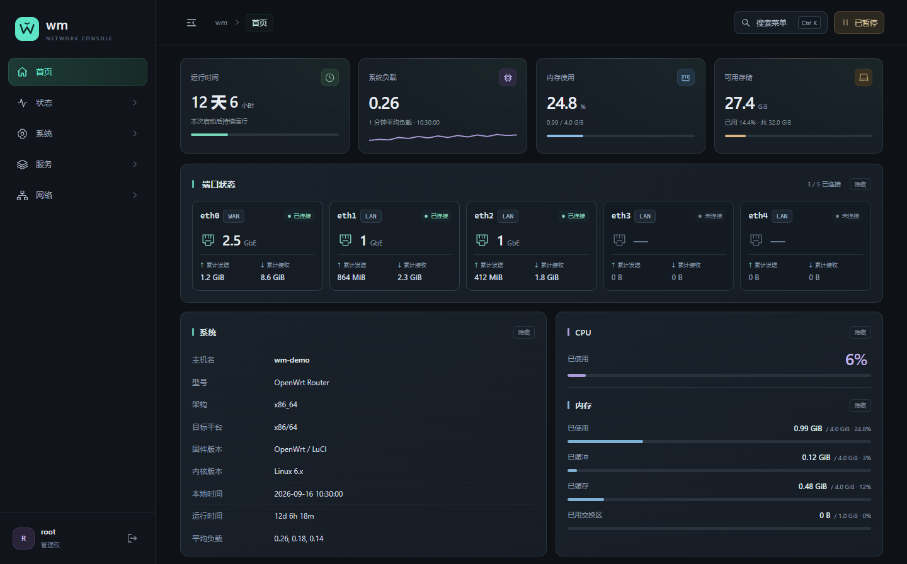
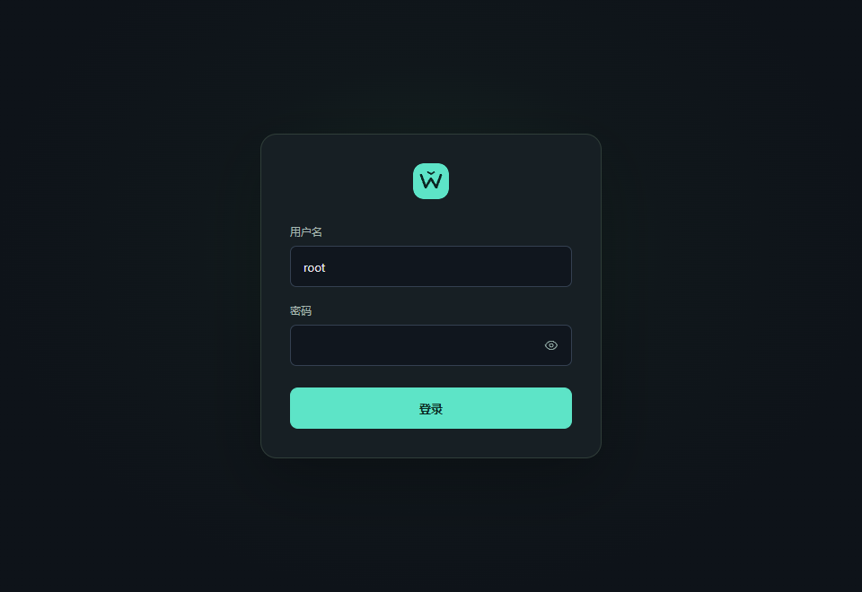

# wm

为 OpenWrt LuCI 制作的现代暗黑主题。石墨黑背景、薄荷绿强调色、可折叠侧栏、响应式内容区，以及简洁的居中登录界面。

**当前版本：1.13.26-1 · 软件包架构：all · 许可证：Apache-2.0**

## 界面预览

以下为实际主题界面截图，设备信息与运行数值已替换为演示数据。点击图片可查看原图。

### 首页概览

石墨黑背景、薄荷绿侧栏，以及运行状态、网络端口和系统资源卡片。



### 登录界面

居中登录卡片，搭配薄荷绿按钮与简洁的密码显隐控件。



## 下载

在 [最新 Release](https://github.com/xwei888/luci-theme-wm/releases/latest) 页面下载：

- `luci-theme-wm_1.13.26-1_all.ipk`：安装包。
- `luci-theme-wm-1.13.26-source.tar.gz`：对应版本源码。
- `SHA256SUMS`：文件校验值。

安装方法见下方「安装与启用」，版本变化见 [CHANGELOG.md](CHANGELOG.md)。

主题名称和 UCI 注册键均为 `wm`，软件包名为 `luci-theme-wm`，静态资源路径为 `/luci-static/wm/`，模板目录为 `themes/wm/`，菜单模块为 `menu-wm.js`。

在「系统 → 系统 → 常规设置」修改主机名并保存应用后，刷新页面即可显示新名称。管理页面浏览器标题为“主机名 | 当前页面”；登录页标题始终为“主机名 | 登录”，例如 `wm | 登录`。登录卡片不显示主机名。

## 功能

- 使用设备本地字体：苹果设备优先系统字体，Windows 使用 Segoe UI 与微软雅黑；无需下载字体文件。
- 软件包管理页采用分组工具区、独立磁盘用量说明和紧凑分页；窄屏显示软件包卡片，保留筛选、排序与原生操作流程。
- 独立主题目录，保留 LuCI 的菜单权限、表单、验证、保存与应用机制。
- 侧栏折叠、分组展开动画、当前页面高亮；收起后点击分组打开侧边浮层，跳转后保持折叠，长菜单可滚动，支持方向键和 Esc。手机使用抽屉菜单与键盘焦点管理。移除 WORKSPACE 标题，收起时保留可见退出按钮。
- `Ctrl + K` / `⌘ + K` 搜索菜单，支持方向键和 Enter。
- 收起侧栏后的浮层条目保留独立间距和完整文字，长菜单滚动显示。搜索结果上下展示功能名称和所属路径，长文字自动换行，右侧导航箭头独立占位。
- 顶栏搜索与自动刷新采用等高紧凑控件；刷新指示器保留原生暂停/恢复行为，并支持键盘操作。
- PassWall 2 的出口 IP 与网站连接状态位于表单操作之后，使用深色信息栏，窄屏自动换行，避免遮挡保存按钮。按钮的常态、悬停、按下及键盘聚焦保持清晰对比度。
- 系统概览卡片：启动时长、1 分钟负载、内存使用、可用存储。
- 首页采用独立样式：顶部直接展示四项关键指标，下方排列端口卡片；系统信息与合并的 CPU/内存卡片等高并排，窄屏自动堆叠。资源数值位于细进度条上方，保留原生数据与隐藏操作。
- 首页卡片依次入场，滚动时轻量显现，数据变动时提供短暂反馈；减少动态效果模式关闭动画。
- 首页统一收紧卡片高度、内边距和区块间距；端口名、所属网络与连接状态并列，突出链路速率，底部展示累计发送和接收量，附带连接数量汇总。窄屏使用紧凑横向布局，保留原生自动刷新、分区隐藏和可键盘聚焦的详细统计提示。
- 网络区按列对齐上游协议、地址、网关、DNS 和连接时间，设备与 MAC 信息位于底部；活动连接与在线用户数使用独立统计卡片。布局随可用宽度调整，保留原生数据与刷新机制。
- 磁盘与 NVMe 信息采用紧凑卡片，分别展示设备名、型号、容量、序列号及固件版本；保留实际分区说明，移除仅重复总容量的色条，空设备列表显示简洁提示。
- 首页使用独立地址 `/cgi-bin/luci/admin/wm/home`，复用真实状态概览内容，菜单、页面标题和面包屑均保持为“首页”。移除重复的「状态 → 概览」菜单和搜索入口，旧概览地址自动跳转首页；状态菜单的其他页面继续保留。侧栏品牌和菜单搜索也指向新首页。
- 指标通过 LuCI RPC 读取真实数据，每 10 秒更新；负载曲线只绘制打开页面后采集的实际样本。标签页不可见时暂停主题采样。
- 定制登录页、密码显示开关、悬停反馈、页面进入与加载动画。
- 表格、选项卡、下拉框、弹窗、进度条和接口卡片的统一暗黑样式。
- 选项卡使用细线高亮、悬停过渡及键盘焦点提示；窄屏保持单行，支持横向滑动与方向键切换焦点，自动露出当前选项。动态列表添加按钮按文字宽度展开，兼容“添加密钥”和“＋”两类入口。
- 未选中的选项卡面板同步收起内边距、边框和外边距，避免隐藏内容继续占位，切换后保留正常内容间距。
- 原生密码框搭配等高眼睛按钮，显示/隐藏时图标同步切换；菜单初始化采用骨架占位，避免刷新时闪现英文加载文字。
- 表单按钮统一间距，动态列表在空白和窄屏状态下保持可输入宽度；配置列表统一标题留白、操作按钮和跨列居中的空状态。
- 内容区按实际可用宽度调整卡片和表单，900px 以下采用抽屉菜单；宽表格在自身区域滚动，支持键盘操作。
- 顶栏保留搜索和状态操作，页脚精简为 `wm · LuCI`。
- 实时负载、带宽和连接页面使用统一图表配色及统计卡片；DHCP 租约按类别展示，窄屏自动调整布局。
- 保存成功提示与内容区等宽，重复保存不堆叠；配置应用、软件包等待提示保持紧凑。
- 登录必填提示显示在字段下方；密码显隐控件、下拉框、表单对齐和提示气泡统一适配。
- 页面采用细圆角滚动条，悬停与拖动时加亮；触摸和高对比度模式保留原生表现。
- 尊重 `prefers-reduced-motion`，不加载远程字体、脚本或统计服务。

## 当前适配范围

已在 Kwrt 25.12-SNAPSHOT、x86_64、LuCI `27.161.22447~40792d9` 的实际设备验证。
模板使用 ucode，不支持仅有旧 Lua 模板引擎的 LuCI。其他固件和第三方插件尚需分别验证。
系统概览的双栏布局针对验证环境的 System / CPU / Ports / Memory 模块顺序适配。部分首页分区适配依赖模块标题，其他语言和模块组合尚未完整验证。

## 安装与启用

将发行包上传到路由器 `/tmp`，运行：

```sh
opkg install /tmp/luci-theme-wm_1.13.26-1_all.ipk
uci set luci.main.mediaurlbase='/luci-static/wm'
uci commit luci
```

也可在「系统 → 系统 → 语言和界面」选择 **wm**。
浏览器刷新后生效；旧缓存可用 `Ctrl + F5` 刷新。无需重启路由器。

### 从旧包迁移

先安装并启用新版，确认页面正常后再移除旧包。旧包卸载脚本会清理旧主题注册项，因此最后重新写入 `wm` 注册项：

```sh
opkg remove luci-theme-nocturne
uci set luci.themes.wm='/luci-static/wm'
uci set luci.main.mediaurlbase='/luci-static/wm'
uci commit luci
```

## 回退

选择之前的主题，或通过 SSH 执行：

```sh
uci set luci.main.mediaurlbase='/luci-static/bootstrap'
uci commit luci
```

通常只需切换主题，无需恢复整份配置。安装前可自行备份 `/etc/config/luci`。

卸载：

```sh
opkg remove luci-theme-wm
```

发行 IPK 的卸载脚本会在 wm 主题正被使用时切回 Bootstrap。

## 源码与构建

- `htdocs/luci-static/wm/cascade.css`：配色、布局、组件和响应式样式。
- `htdocs/luci-static/wm/theme.js`：交互、搜索和真实指标。
- `htdocs/luci-static/wm/home.css` / `home.js`：仅在首页加载的布局、端口图标与动画。
- `htdocs/luci-static/resources/menu-wm.js`：LuCI 菜单及子页面选项卡。
- `ucode/template/themes/wm/`：页面结构和登录模板。
- `htdocs/luci-static/wm/base.css`：随本机 LuCI 提取的 Bootstrap 兼容基础，保留原版权声明。

在仓库根目录用 Python 3 运行：

```sh
python tools/build.py
```

构建结果位于仓库目录旁的 `dist/`，包含 IPK 与源码包。源码归档仅包含项目公开文件，排除 Git 元数据和本地验证记录。
无需额外 Python 包或交叉编译器。也提供 OpenWrt SDK 使用的 LuCI Makefile。

## 指标口径

- 负载是 runnable / uninterruptible tasks 的平均数量，不是 CPU 百分比。
- 主题内存使用率优先按 `总内存 - MemAvailable` 计算，因此可能与固件原有内存面板的口径不同。
- 存储读取 `system.info.root`（KiB），显示为 GiB。
- 获取失败时显示刷新失败提示，不生成模拟数据。

## 许可证

Apache-2.0，详见 `LICENSE` 与 `NOTICE`。
